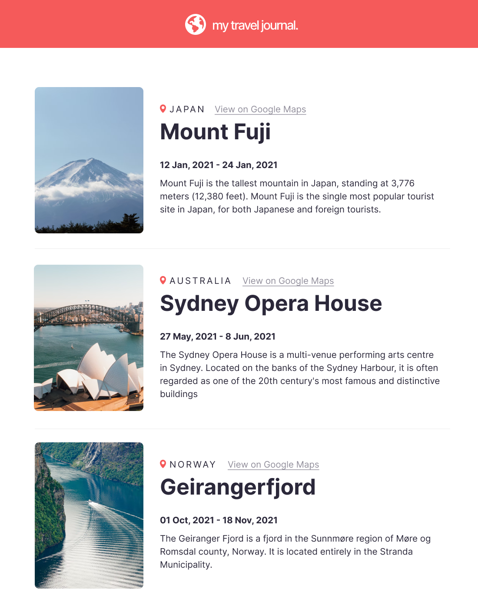

# FreeCodeCamp Solo Project
Learning React on FreeCodeCamp
this is the second project proposed by the teacher Bob Ziroll

## Travel Journal

Visit [My Travel Journal](https://fcc-my-travel-journal) to see the project

### Requirements
- Build from scracth
- Data array in a separate .js file
    - Title, location, Google Maps link, start date, end date, description, image URL
- User .map() and props
- Styled & polished

